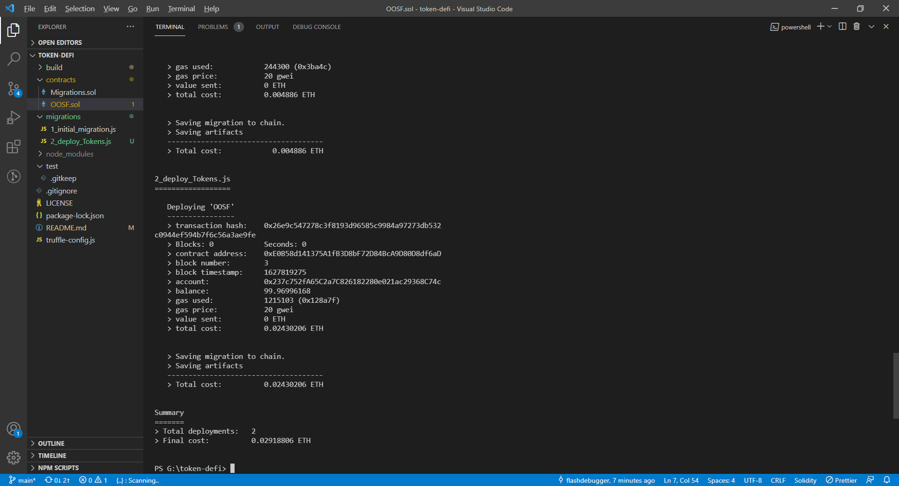
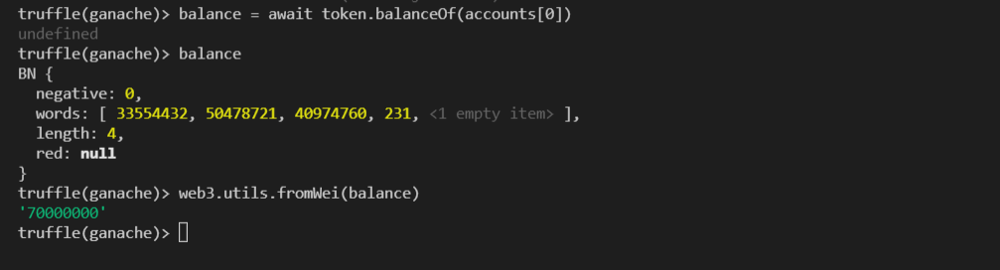
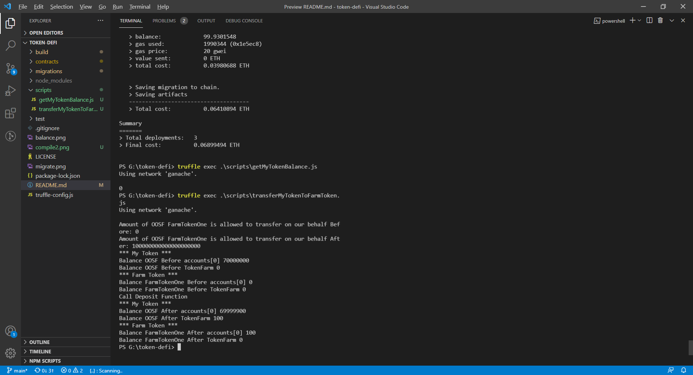

# token-defi

CREATE AND DEPLOY A DEFI APP

 

### Steps ( my token )

    truffle init

    npm install @openzeppelin/contracts

    truffle version

    truffle compile

    truffle migrate

 

### Test on truffle/ganache

    truffle console

- Get the smart contract: `myToken = await OOSF.deployed()`

- Get the array of accounts from Ganache: `accounts = await web3.eth.getAccounts()`

- Get the balance for the first account: `balance = await myToken.balanceOf(accounts[0])`

- Format the balance from 18 decimals: `web3.utils.fromWei(balance)`

 

### Create farm token and deploy ( farm token )

    truffle compile

    truffle migrate

### Test farm token ( added getMyTokenBalance.js to automate the test)

    truffle exec .\scripts\getMyTokenBalance.js

    truffle exec .\scripts\transferMyTokenToFarmToken.js

    truffle exec .\scripts\withdrawMyTokenFromTokenFarm.js

 

### [Reference](https://medium.com/@justinben/create-and-deploy-a-defi-app-a5d4e040da86) for this contracts
